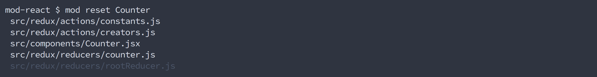
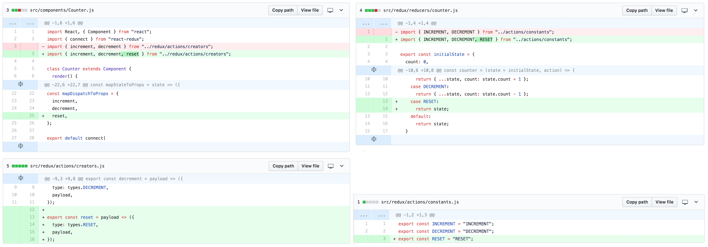
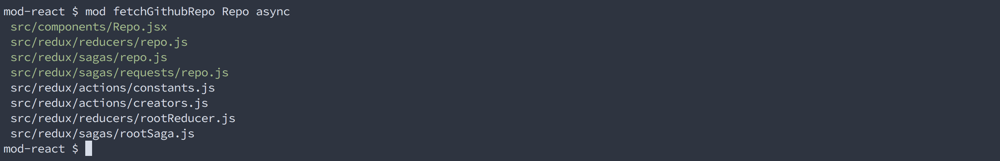
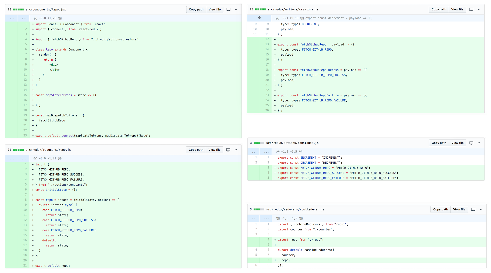
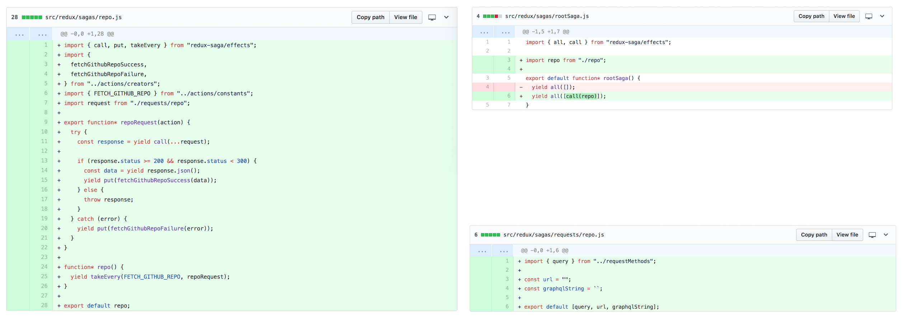

[](https://badge.fury.io/js/%40mod-cli%2Fmod-cli)
[](https://travis-ci.com/jonroby/mod-cli)
[](https://codeclimate.com/github/jonroby/mod-cli/maintainability)
[](https://codeclimate.com/github/jonroby/mod-cli/test_coverage)

# Mod CLI

It isn't always possible to eliminate boilerplate code. Perhaps it's just part
of the language/framework, or maybe you're unable to figure out an abstraction.
It could be that the team can't agree on how, or they don't even consider it a problem.
Whatever the reason, you're stuck rewriting code over... and over... and over again.

Mod CLI is a tool that can help automate these tasks. You install it along with
the plugin of your choice (or likely, you'll need to write your own). Then
in the command line type `mod <your> <command> --with --options`.
And on enter, all that repetitious code is added to your project!

## Example

To start clone the following repo.

`$ git clone https://github.com/jonroby/mod-react.git`

`cd` into it and `$ npm i && npm start`.

It's a simple counter app with incrementing and decrementing. Now let's say we
want to add functionality for resetting the counter. If you've written any Redux,
you know that this involves several steps including writing an action creator, an
action constant that is placed in a reducer's case statement, etc. And that
doesn't even include all the importing and exporting. Of course, this is price
to pay for Redux's simplicity, but wouldn't it be nice to avoid writing all of
this repetitious code?

To help, install Mod CLI globally. 

`$ npm i -g @mod-cli/mod-cli`

By itself, Mod CLI can't do anything. It needs a plugin that specifies all of the
desired file transformations. I've written one for this project.

`$ npm i -S @mod-cli/mod-react-plugin`

Write the plugin name in a `.mod` file so that Mod CLI will use this plugin
to execute the transformations:

`$ echo '@mod-cli/mod-react-plugin' > .mod`

We're ready to write our reset functionality. Enter the following command.

```
$ mod reset Counter
    modified mod-react/src/redux/actions/constants.js
    modified mod-react/src/redux/actions/creators.js
    modified mod-react/src/components/Counter.js
    modified mod-react/src/redux/reducers/counter.js
```



We can see that it made modifications to a number of files! White text indicates modifications,
whereas grey text indicates no modifications. To see the particular modifications, here are the
git diffs.



All of the boilerplate has been added! So all we have to do in order to create our reset
functionality is to update our reducer in `src/redux/reducers/counter.js`:

```
...
  case RESET:
    return { ...state, count: 0 };
...
```

And then in `src/components/Counter.js`, right below the decrement button, add a
button with its `onClick` handler set to the newly generated `reset` function,
which is already available from `this.props`.
```
...
  <button onClick={this.props.decrement}>-</button>
  <button onClick={this.props.reset}>0</button>
...
```

That's it! Check it out in the browser.

## Example with Sagas

In the previous example we modified several items that already existed. But what
if we wanted to generate something new? Enter the following command.



Unsurprisingly, the files that are colored green are new files. Again, files
with white colored text indicates they have been modified. I don't want to go into
the specifics of the command, but suffice it to say, that it is possible to
generate files just as easily was it was to modify them.

Please note that components, reducers, sagas aren't required to share the same
name. This syntax is just a convenience if they do. If you wanted to use
different names you'd enter

`mod a -a <actionName> -c <ComponentName> -r <reducerName>`.

Now let's look at what's been generated and modified by adding `async`.



One obvious difference is that the actions now include `success` and `failure`.
Additionally, several files were created for sagas!



Let's make an API call with GraphQL (traditional gets and posts are possible too).
I'll use Github's API. In `src/redux/sagas/requests/repo.js` enter the following
information. 

```
const url = "https://developer.github.com/v4/explorer/";
const graphqlString = `
query { 
  repository(owner: "jonroby", name: "mod-cli") {
    name
    stargazers(last: 10) {
      edges {
	node {
	  name
	}
      }
    }
  }
}
`;
```

If you want to follow along using Github you'll need to add a proxy to the requests,
since the Github API doesn't allow CORS requests.  Alternatively, you can try

```
const url = "https://fakerql.com/graphql";
const graphqlString = `
{
  Todo(id: 1) {
    id
    title
  }
}
`;
```

We know that we'll want these values in our reducer store, so we can do that by

`$ mod x {name,stargazers} -c Repo -r repo`

This will add the keys to initial state in repo reducer and to mapStateToProps in
the Repo component!

```
// src/redux/reducers/repo.js
...
const initialState = {
  name: null,
  stargazers: null,
};
```

```
// src/components/Component.jsx
...
const mapStateToProps = state => ({
  name: state.repo.name,
  stargazers: state.repo.stargazers
});
```

If you're using the FakerQL endpoint, try this: (of course you wouldn't want your Todos
held in state this way; this is only for the purpose of illustration):

`$ mod x {id, title} -c Repo -r repo`

Now we'll want to include our new Repo component in the app, instead of the Counter.
So in `App.jsx`, make the following changes.

```
...
import Repo from "./Repo.jsx";

...

<Switch>
  <Route path="/" component={Repo} exact />
</Switch>

...
```

Then in Repo:
```
// src/components/Repo.jsx
...
return (
  <div>
    <div>Repo: {this.props.name}</div>
    <div>Repo: {this.props.stargazers.map(s => (
      <div>{s}</div> 
    ))}</div>
    <button onClick={this.props.fetchGithubRepo}></button>     
  </div>
);
...
```

```
// src/redux/reducers/repo.js
...
  case FETCH_GITHUB_REPO_SUCCESS:
    return {
      ...state,
      name: action.payload.data.repository.name,
      stargazers: action.payload.data.repository.edges.map(e => e.node.name)	
    };
...
```

Now you're ready! Try clicking and you'll see everything works!
